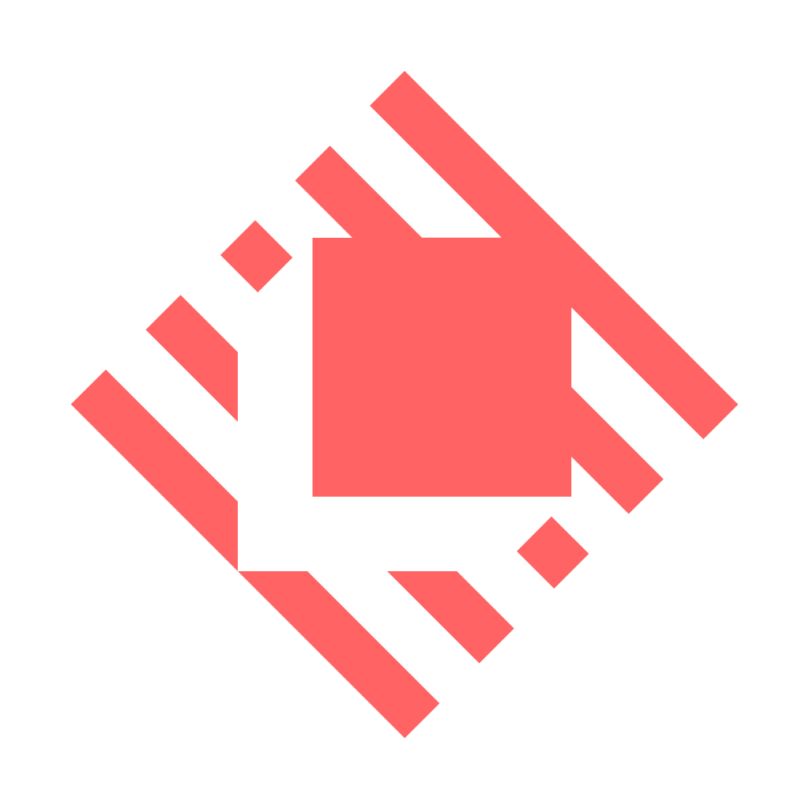

# Eitel Dagnin ⚡

*DevOps engineer building tools that make codebases cleaner and pipelines faster.*

  
  
  
  
  
  
  
  
  

Hey! 👋 I'm a **DevOps engineer** based in the Netherlands 🇳🇱, originally from Cape Town 🇿🇦. I spend my days on CI/CD governance, platform automation, and infrastructure — and my evenings shipping open-source developer tools under [LGTM HQ](https://github.com/lgtm-hq).

🤖 Everything I ship is **AI-augmented** — Claude Code, Cursor, and Codex write the code; CodeRabbit and Greptile review it. But every line still passes through [Lintro](https://github.com/lgtm-hq/py-lintro) (28+ tools), OpenSSF Scorecard compliance, and full CI pipelines. AI writes faster; the toolchain makes sure it writes correctly.

## 🛠️ Projects

### 🧹 [Lintro](https://github.com/lgtm-hq/py-lintro)

Unified CLI for linting, formatting, and quality assurance across 28+ tools. Published to PyPI, Homebrew, and GHCR.

`Python` `Docker` `Shell` `Rust`

### 🔄 [lgtm-ci](https://github.com/lgtm-hq/lgtm-ci)

Reusable GitHub Actions workflow library — 30+ workflows for quality gates, publishing, security scanning, and deployment. SHA-pinned and consumed across the org.

`Shell` `YAML` `GitHub Actions`

### 🎨 [Turbo Themes](https://github.com/lgtm-hq/turbo-themes)

Universal, accessible theme packs with a drop-in theme selector. Catppuccin, Dracula, GitHub, Bulma, and more — on npm, PyPI, RubyGems, and SwiftPM.

`TypeScript` `CSS`

### 📄 [Rustume](https://github.com/lgtm-hq/Rustume)

Privacy-first, offline-first résumé builder powered by Rust and Typst. Dockerized deployment with multi-stage builds.

`Rust` `TypeScript` `Typst`

###  Raycast Extensions

[Zshrc Manager](https://github.com/raycast/extensions/tree/main/extensions/zshrc-manager) · [Bunq](https://github.com/TurboCoder13/extensions/tree/add-bunq-extension/extensions/bunq)

## 📊 Stats

| | |
| --- | --- |
| 🧹 **Lintro tools** | 28+ |
| 🔄 **lgtm-ci workflows** | 30+ |
| 🏢 **[LGTM HQ](https://github.com/lgtm-hq) repos** | 11 |
| 📦 **Published to** | PyPI · npm · Homebrew · GHCR |

  
  
  

  
  

